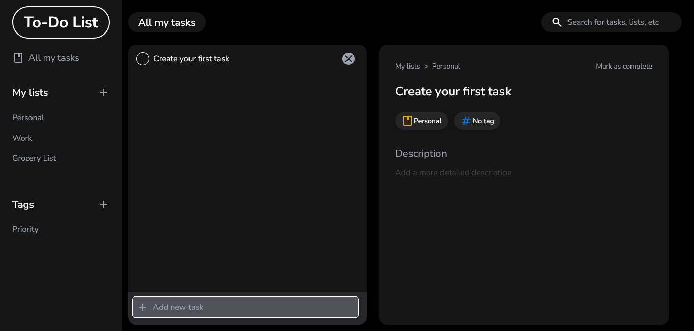

# To Do List

This project was inspired from any.do todo app.

## Table of contents

- [Overview](#overview)
  - [Features](#features)
  - [Screenshot](#screenshot)
  - [Links](#links)
- [My process](#my-process)
  - [Built with](#built-with)

## Overview

### Features

Users should be able to:

- View all the lists and tags and edit them.
- View all the tasks or the tasks for a specific list or tag.
- Expand a single task to see/edit its details.
- Add, search and delete tasks.

### Screenshot

### Links

- Solution URL: https://github.com/HediElOuni/To-Do-List
- Live Site URL: https://to-do-list-heo.netlify.app/

## My process

### Built with

- HTML
- CSS
- JavaScript
- Tailwind
- React
